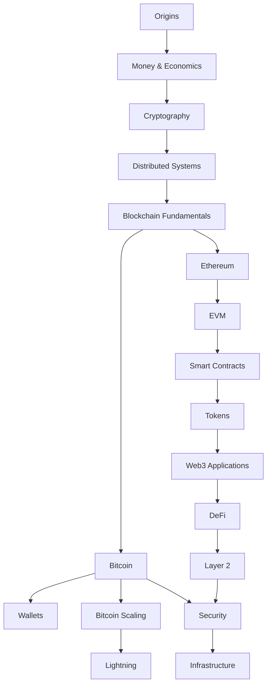
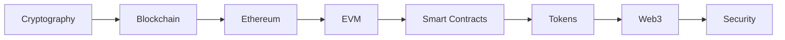
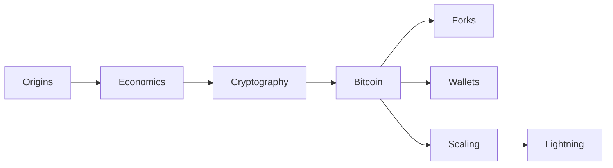

  

<h1 align="center">Blockchain Engineering</h1>

Understanding blockchain through code.

  <a href="#start-reading">Start reading</a>
  ·
  <a href="./SUMMARY.md">Full contents</a>
  ·
  <a href="./PROGRESS.md">Progress</a>
  ·
  <a href="./glossary.md">Glossary</a>
  ·
  <a href="./resources.md">Resources</a>

  
  
  

---

Blockchain Engineering is an open-source technical book about Bitcoin, Ethereum, cryptography, distributed systems, monetary economics, smart contracts, DeFi, scaling, security, and blockchain infrastructure.

The book approaches blockchain from a software engineer's perspective: understand the mechanism first, then inspect it, reproduce it, and build with it.

> [!NOTE]
> This book is about engineering, protocols, and economic context. It does not cover trading strategies or price speculation.

## Book map

## Start reading

| Path | Start here | Focus |
| --- | --- | --- |
| Beginner | [Origins](./chapters/origins/README.md) | Full conceptual foundation |
| Software engineer | [Cryptography](./chapters/cryptography/README.md) | Protocols, execution, and code |
| Bitcoin | [Origins](./chapters/origins/README.md) | Bitcoin, wallets, forks, and Lightning |
| Ethereum | [Ethereum](./chapters/ethereum/README.md) | Accounts, EVM, contracts, DeFi, and Layer 2 |

### Beginner path

### Software engineer path

### Bitcoin path

## Explore the book

<strong>Origins</strong>: digital cash, Cypherpunks, Satoshi, and the work that came before Bitcoin

 

- [Why Digital Cash Was Hard](./chapters/origins/digital-cash.md)
- [The Cypherpunk Movement](./chapters/origins/cypherpunks.md)
- [David Chaum and DigiCash](./chapters/origins/digicash.md)
- [Hashcash](./chapters/origins/hashcash.md)
- [b-money](./chapters/origins/b-money.md)
- [Bit Gold](./chapters/origins/bit-gold.md)
- [Who Was Satoshi Nakamoto?](./chapters/origins/satoshi.md)
- [The Bitcoin Whitepaper](./chapters/origins/bitcoin-whitepaper.md)
- [The Genesis Block](./chapters/origins/genesis-block.md)
- [Early Bitcoin History](./chapters/origins/early-bitcoin.md)

<strong>Money and Economics</strong>: money, banking, monetary policy, Austrian economics, and competing views

 

- [What Is Money?](./chapters/economics/money.md)
- [Functions of Money](./chapters/economics/functions-of-money.md)
- [Commodity Money](./chapters/economics/commodity-money.md)
- [Fiat Money](./chapters/economics/fiat-money.md)
- [Banking and Credit](./chapters/economics/banking-and-credit.md)
- [Inflation and Deflation](./chapters/economics/inflation-and-deflation.md)
- [Central Banking](./chapters/economics/central-banking.md)
- [Monetary Policy](./chapters/economics/monetary-policy.md)
- [Bitcoin as Money](./chapters/economics/bitcoin-as-money.md)

#### Austrian economics

- [Carl Menger and the Origin of Money](./chapters/economics/menger.md)
- [Ludwig von Mises and Monetary Theory](./chapters/economics/mises.md)
- [Friedrich Hayek and Competing Currencies](./chapters/economics/hayek.md)
- [Murray Rothbard and Sound Money](./chapters/economics/rothbard.md)
- [Austrian Economics and Bitcoin](./chapters/economics/austrian-economics-and-bitcoin.md)

<strong>Cryptography</strong>: hashes, keys, signatures, elliptic curves, and Merkle trees

 

- [What Cryptography Does](./chapters/cryptography/README.md)
- [Hash Functions](./chapters/cryptography/hashes.md)
- [SHA-256](./chapters/cryptography/sha-256.md)
- [Public-Key Cryptography](./chapters/cryptography/public-key-cryptography.md)
- [Private and Public Keys](./chapters/cryptography/keys.md)
- [Digital Signatures](./chapters/cryptography/digital-signatures.md)
- [ECDSA](./chapters/cryptography/ecdsa.md)
- [Schnorr Signatures](./chapters/cryptography/schnorr.md)
- [Merkle Trees](./chapters/cryptography/merkle-trees.md)
- [Zero-Knowledge Proofs](./chapters/cryptography/zero-knowledge.md)

<strong>Bitcoin</strong>: transactions, UTXOs, mining, Script, SegWit, Taproot, and monetary policy

 

#### Core concepts

- [How Bitcoin Works](./chapters/bitcoin/README.md)
- [Transactions](./chapters/bitcoin/transactions.md)
- [The UTXO Model](./chapters/bitcoin/utxo.md)
- [The Mempool](./chapters/bitcoin/mempool.md)
- [Transaction Confirmation](./chapters/bitcoin/confirmation.md)

#### Mining

- [Proof of Work](./chapters/bitcoin/proof-of-work.md)
- [Mining](./chapters/bitcoin/mining.md)
- [Difficulty Adjustment](./chapters/bitcoin/difficulty-adjustment.md)
- [The Halving](./chapters/bitcoin/halving.md)
- [Mining Pools](./chapters/bitcoin/mining-pools.md)

#### Protocol

- [Bitcoin Script](./chapters/bitcoin/script.md)
- [SegWit](./chapters/bitcoin/segwit.md)
- [Taproot](./chapters/bitcoin/taproot.md)

<strong>Wallets, Forks, and Scaling</strong>: key management, protocol upgrades, payment channels, and Lightning

 

- [Wallets](./chapters/wallets/README.md)
- [Seed Phrases](./chapters/wallets/seed-phrases.md)
- [HD Wallets](./chapters/wallets/hd-wallets.md)
- [What Is a Fork?](./chapters/forks/README.md)
- [Soft Forks](./chapters/forks/soft-forks.md)
- [Hard Forks](./chapters/forks/hard-forks.md)
- [The Scaling Problem](./chapters/bitcoin-scaling/README.md)
- [Lightning Network](./chapters/lightning/README.md)
- [HTLCs](./chapters/lightning/htlcs.md)
- [Routing Payments](./chapters/lightning/routing.md)

<strong>Ethereum and EVM</strong>: accounts, state, gas, Proof of Stake, bytecode, and execution

 

- [What Is Ethereum?](./chapters/ethereum/README.md)
- [Ethereum Accounts](./chapters/ethereum/accounts.md)
- [Transactions](./chapters/ethereum/transactions.md)
- [Gas](./chapters/ethereum/gas.md)
- [Ethereum State](./chapters/ethereum/state.md)
- [JSON-RPC](./chapters/ethereum/json-rpc.md)
- [Proof of Stake](./chapters/ethereum/proof-of-stake.md)
- [The EVM](./chapters/evm/README.md)
- [Bytecode](./chapters/evm/bytecode.md)
- [Opcodes](./chapters/evm/opcodes.md)
- [Memory](./chapters/evm/memory.md)
- [Storage](./chapters/evm/storage.md)

<strong>Smart Contracts, Tokens, and Web3</strong>: Solidity, ABI, token standards, wallets, RPC, and signatures

 

- [Smart Contracts](./chapters/contracts/README.md)
- [Solidity](./chapters/contracts/solidity.md)
- [Contract ABI](./chapters/contracts/abi.md)
- [Events and Logs](./chapters/contracts/events.md)
- [ERC-20](./chapters/tokens/erc-20.md)
- [ERC-721](./chapters/tokens/erc-721.md)
- [ERC-1155](./chapters/tokens/erc-1155.md)
- [Web3 Application Architecture](./chapters/web3/README.md)
- [Connecting Wallets](./chapters/web3/wallet-connections.md)
- [Sending Transactions](./chapters/web3/sending-transactions.md)
- [Typed Data and EIP-712](./chapters/web3/eip-712.md)

<strong>DeFi and Layer 2</strong>: AMMs, lending, stablecoins, rollups, sequencers, and bridges

 

- [What Is DeFi?](./chapters/defi/README.md)
- [Stablecoins](./chapters/defi/stablecoins.md)
- [Automated Market Makers](./chapters/defi/amm.md)
- [Constant Product Formula](./chapters/defi/constant-product.md)
- [Liquidity Pools](./chapters/defi/liquidity-pools.md)
- [Lending](./chapters/defi/lending.md)
- [Oracles](./chapters/defi/oracles.md)
- [Why Layer 2 Exists](./chapters/layer2/README.md)
- [Rollups](./chapters/layer2/rollups.md)
- [Optimistic Rollups](./chapters/layer2/optimistic-rollups.md)
- [Zero-Knowledge Rollups](./chapters/layer2/zk-rollups.md)
- [Sequencers](./chapters/layer2/sequencers.md)
- [Bridges](./chapters/layer2/bridges.md)

<strong>Security and Infrastructure</strong>: exploits, defensive design, nodes, RPC, indexing, and reliability

 

- [Security Model](./chapters/security/README.md)
- [Approval Attacks](./chapters/security/approval-attacks.md)
- [Reentrancy](./chapters/security/reentrancy.md)
- [Oracle Manipulation](./chapters/security/oracle-manipulation.md)
- [MEV](./chapters/security/mev.md)
- [Bridge Exploits](./chapters/security/bridge-exploits.md)
- [Infrastructure Overview](./chapters/infrastructure/README.md)
- [Running a Node](./chapters/infrastructure/running-a-node.md)
- [RPC Providers](./chapters/infrastructure/rpc-providers.md)
- [Indexers](./chapters/infrastructure/indexers.md)
- [Reorg Handling](./chapters/infrastructure/reorg-handling.md)

For the complete chapter-by-chapter index, see [SUMMARY.md](./SUMMARY.md).

## Learning by building

| Level | Project | Concepts |
| --- | --- | --- |
| Foundation | [Build a small blockchain](./examples/simple-blockchain/) | blocks, hashes, Proof of Work |
| Bitcoin | [Decode a transaction](./examples/bitcoin/) | serialization, txids, block headers, Proof of Work |
| Ethereum | [Query a node](./examples/ethereum-rpc/) | raw JSON-RPC, blocks, balances, logs |
| Ethereum | [Compile and inspect contracts](./examples/solidity/) | Solidity, ABI, bytecode, compiler errors |
| Web3 | [Build Wallet Stats](./examples/wallet-stats/) | balances, RPC, contract detection, token balances |
| DeFi | [Model an AMM](./examples/defi/) | constant product, fees, slippage, price impact |
| Infrastructure | [Build a reorg-safe indexer](./examples/indexer/) | blocks, events, checkpoints, reorganizations |

## By the end

You should be able to explain:

- how Bitcoin prevents double spending
- what miners actually compute
- how wallets derive and use keys
- why Bitcoin uses UTXOs
- how Ethereum executes smart contracts
- what gas pays for
- how token standards work
- how AMMs price assets
- what rollups move off-chain
- why bridges are difficult to secure
- how blockchain applications query and index on-chain data

## Sources and writing

The book prioritizes primary sources, protocol specifications, original papers, source code, and original economic texts.

See [WRITING.md](./WRITING.md) for research, sourcing, and editorial guidelines.

> [!IMPORTANT]
> Historical claims, especially claims about Satoshi Nakamoto, should distinguish documented evidence from inference and speculation.

## Status

The first complete edition is finished. All 21 sections, 332 chapter and section pages, the glossary, resources, and seven runnable projects have passed the repository's link, navigation, editorial, test, and type-check checks.

See [PROGRESS.md](./PROGRESS.md) for the section-by-section record and verification commands.

## Contributing

Corrections, technical reviews, clearer explanations, and links to primary sources are welcome.

See [CONTRIBUTING.md](./CONTRIBUTING.md).

> [!WARNING]
> Never use production private keys, seed phrases, or meaningful funds while experimenting with code from this repository.

## Disclaimer

This repository is about blockchain engineering, distributed systems, and software development.

It is not financial, investment, legal, or tax advice.

## License

[MIT](./LICENSE)
