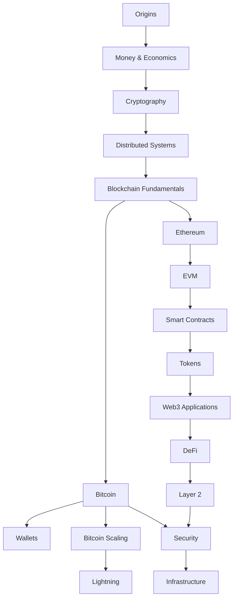
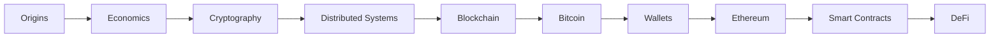
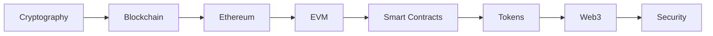
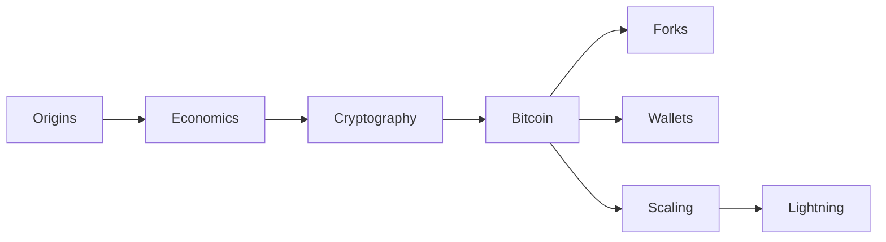

<p align="center">
  <a href="https://github.com/GuilhermeAlbert/blockchain-engineering/">
    
  </a>
</p>

<h1 align="center">Engenharia Blockchain</h1>

<p align="center">Entenda blockchain por meio de código.</p>

<p align="center">
  <a href="../">English</a>
  ·
  <strong>Português do Brasil</strong>
</p>

<p align="center">
  <a href="#iniciar-a-leitura">Iniciar a leitura</a>
  ·
  <a href="./SUMMARY.md">Conteúdo completo</a>
  ·
  <a href="./PROGRESS.md">Progresso</a>
  ·
  <a href="./glossary.md">Glossário</a>
  ·
  <a href="./resources.md">Recursos</a>
</p>

<p align="center">
  
  
  
</p>

---

Blockchain Engineering é um livro técnico de código aberto sobre Bitcoin, Ethereum, criptografia, sistemas distribuídos, economia monetária, contratos inteligentes, DeFi, escala, segurança e infraestrutura blockchain.

O livro aborda blockchain da perspectiva de quem desenvolve software: primeiro entende o mecanismo, depois o inspeciona, reproduz e usa para construir sistemas.

> [!NOTE]
> Este livro trata de engenharia, protocolos e contexto econômico. Não aborda estratégias de negociação nem especulação de preços.

Esta edição mantém os mesmos nomes de arquivo da edição inglesa para preservar links, histórico e exemplos compartilhados. O texto, a navegação e o material editorial estão em português brasileiro; código, identificadores e citações primárias permanecem no idioma original quando a tradução reduziria a precisão.

## Mapa do livro



## Iniciar a leitura

| Perfil | Comece aqui | Foco |
| --- | --- | --- |
| Iniciante | [Origens](./chapters/origins/README.md) | Fundamentação conceitual completa |
| Engenheiro de software | [Criptografia](./chapters/cryptography/README.md) | Protocolos, execução e código |
| Bitcoin | [Origens](./chapters/origins/README.md) | Bitcoin, carteiras, forks e Lightning |
| Ethereum | [Ethereum](./chapters/ethereum/README.md) | Contas, EVM, contratos, DeFi e Camada 2 |

### Caminho inicial



### Caminho do engenheiro de software



### Caminho do Bitcoin



## Explore o livro

<details>
<summary><strong>Origens</strong>: dinheiro digital, cypherpunks, Satoshi e o trabalho anterior ao Bitcoin</summary>

<br>

- [Por que o dinheiro digital era difícil](./chapters/origins/digital-cash.md)
- [O Movimento Cypherpunk](./chapters/origins/cypherpunks.md)
- [David Chaum e DigiCash](./chapters/origins/digicash.md)
- [Hashcash](./chapters/origins/hashcash.md)
- [b-money](./chapters/origins/b-money.md)
- [Bit Gold](./chapters/origins/bit-gold.md)
- [Quem era Satoshi Nakamoto?](./chapters/origins/satoshi.md)
- [O whitepaper do Bitcoin](./chapters/origins/bitcoin-whitepaper.md)
- [O Bloco de Gênesis](./chapters/origins/genesis-block.md)
- [História inicial do Bitcoin](./chapters/origins/early-bitcoin.md)

</details>

<details>
<summary><strong>Dinheiro e economia</strong>: moeda, sistema bancário, política monetária, economia austríaca e visões concorrentes</summary>

<br>

- [O que é dinheiro?](./chapters/economics/money.md)
- [Funções do Dinheiro](./chapters/economics/functions-of-money.md)
- [Moeda-mercadoria](./chapters/economics/commodity-money.md)
- [Moeda Fiduciária](./chapters/economics/fiat-money.md)
- [Banco e Crédito](./chapters/economics/banking-and-credit.md)
- [Inflação e deflação](./chapters/economics/inflation-and-deflation.md)
- [Banco Central](./chapters/economics/central-banking.md)
- [Política monetária](./chapters/economics/monetary-policy.md)
- [Bitcoin como dinheiro](./chapters/economics/bitcoin-as-money.md)

#### Economia austríaca

- [Carl Menger e a Origem do Dinheiro](./chapters/economics/menger.md)
- [Ludwig von Mises e Teoria Monetária](./chapters/economics/mises.md)
- [Friedrich Hayek e Moedas Competitivas](./chapters/economics/hayek.md)
- [Murray Rothbard e moeda sólida](./chapters/economics/rothbard.md)
- [Economia austríaca e Bitcoin](./chapters/economics/austrian-economics-and-bitcoin.md)

</details>

<details>
<summary><strong>Criptografia</strong>: hashes, chaves, assinaturas, curvas elípticas e árvores de Merkle</summary>

<br>

- [O Que A Criptografia Faz](./chapters/cryptography/README.md)
- [Funções do Hash](./chapters/cryptography/hashes.md)
- [SHA-256](./chapters/cryptography/sha-256.md)
- [Criptografia de Chave Pública](./chapters/cryptography/public-key-cryptography.md)
- [Chaves privadas e públicas](./chapters/cryptography/keys.md)
- [Assinaturas digitais](./chapters/cryptography/digital-signatures.md)
- [ECDSA](./chapters/cryptography/ecdsa.md)
- [Assinaturas Schnorr](./chapters/cryptography/schnorr.md)
- [Árvores de Merkle](./chapters/cryptography/merkle-trees.md)
- [Provas de Conhecimento Zero](./chapters/cryptography/zero-knowledge.md)

</details>

<details>
<summary><strong>Bitcoin</strong>: transações, UTXOs, mineração, Script, SegWit, Taproot, e política monetária</summary>

<br>

#### Conceitos principais

- [Como funciona o Bitcoin](./chapters/bitcoin/README.md)
- [Transações](./chapters/bitcoin/transactions.md)
- [O Modelo UTXO](./chapters/bitcoin/utxo.md)
- [O Mempool](./chapters/bitcoin/mempool.md)
- [Confirmação da transação](./chapters/bitcoin/confirmation.md)

#### Mineração

- [Prova de Trabalho](./chapters/bitcoin/proof-of-work.md)
- [Mineração](./chapters/bitcoin/mining.md)
- [Ajuste de Dificuldade](./chapters/bitcoin/difficulty-adjustment.md)
- [O halving](./chapters/bitcoin/halving.md)
- [Pools de Mineração](./chapters/bitcoin/mining-pools.md)

#### Protocolo

- [Bitcoin Script](./chapters/bitcoin/script.md)
- [SegWit](./chapters/bitcoin/segwit.md)
- [Taproot](./chapters/bitcoin/taproot.md)

</details>

<details>
<summary><strong>Carteiras, forks e escala</strong>: gerenciamento de chaves, upgrades de protocolo, canais de pagamento e Lightning</summary>

<br>

- [Carteiras](./chapters/wallets/README.md)
- [Frases-semente](./chapters/wallets/seed-phrases.md)
- [Carteiras HD](./chapters/wallets/hd-wallets.md)
- [O que é um fork?](./chapters/forks/README.md)
- [Soft forks](./chapters/forks/soft-forks.md)
- [Hard fork](./chapters/forks/hard-forks.md)
- [O Problema de Escala](./chapters/bitcoin-scaling/README.md)
- [Lightning Network](./chapters/lightning/README.md)
- [HTLCs](./chapters/lightning/htlcs.md)
- [Roteamento dos Pagamentos](./chapters/lightning/routing.md)

</details>

<details>
<summary><strong>Ethereum e EVM</strong>: contas, estado, gas, prova de participação, bytecode e execução</summary>

<br>

- [O que é Ethereum?](./chapters/ethereum/README.md)
- [Contas Ethereum](./chapters/ethereum/accounts.md)
- [Transações](./chapters/ethereum/transactions.md)
- [Gas](./chapters/ethereum/gas.md)
- [Estado Ethereum](./chapters/ethereum/state.md)
- [JSON-RPC](./chapters/ethereum/json-rpc.md)
- [Prova de participação](./chapters/ethereum/proof-of-stake.md)
- [O EVM](./chapters/evm/README.md)
- [Bytecode](./chapters/evm/bytecode.md)
- [Opcodes](./chapters/evm/opcodes.md)
- [Memória](./chapters/evm/memory.md)
- [Armazenamento](./chapters/evm/storage.md)

</details>

<details>
<summary><strong>Contratos Inteligentes, Tokens e Web3</strong>: Solidity, ABI, token standards, carteiras, RPC, e assinaturas</summary>

<br>

- [Contratos Inteligentes](./chapters/contracts/README.md)
- [Solidity](./chapters/contracts/solidity.md)
- [Contrato ABI](./chapters/contracts/abi.md)
- [Eventos e logs](./chapters/contracts/events.md)
- [ERC-20](./chapters/tokens/erc-20.md)
- [ERC-721](./chapters/tokens/erc-721.md)
- [ERC-1155](./chapters/tokens/erc-1155.md)
- [Arquitetura de Aplicação Web3](./chapters/web3/README.md)
- [Conectando as Carteiras](./chapters/web3/wallet-connections.md)
- [Enviando Transações](./chapters/web3/sending-transactions.md)
- [Dados tipados e EIP-712](./chapters/web3/eip-712.md)

</details>

<details>
<summary><strong>DeFi e Camada 2</strong>: AMMs, empréstimos, stablecoins, rollups, sequenciadores e pontes</summary>

<br>

- [O que é DeFi?](./chapters/defi/README.md)
- [Stablecoins](./chapters/defi/stablecoins.md)
- [Criadores de Mercado Automatizados](./chapters/defi/amm.md)
- [Fórmula constante do produto](./chapters/defi/constant-product.md)
- [Pools de liquidez](./chapters/defi/liquidity-pools.md)
- [Empréstimos](./chapters/defi/lending.md)
- [Oráculos](./chapters/defi/oracles.md)
- [Por que existe a camada 2](./chapters/layer2/README.md)
- [Rollups](./chapters/layer2/rollups.md)
- [Rollups otimistas](./chapters/layer2/optimistic-rollups.md)
- [Rollups de conhecimento zero](./chapters/layer2/zk-rollups.md)
- [Sequenciadores](./chapters/layer2/sequencers.md)
- [Pontes](./chapters/layer2/bridges.md)

</details>

<details>
<summary><strong>Segurança e infraestrutura</strong>: exploits, projeto defensivo, nós, RPC, indexação e confiabilidade</summary>

<br>

- [Modelo de segurança](./chapters/security/README.md)
- [Ataques de aprovação](./chapters/security/approval-attacks.md)
- [Reentrância](./chapters/security/reentrancy.md)
- [Manipulação do Oracle](./chapters/security/oracle-manipulation.md)
- [MEV](./chapters/security/mev.md)
- [Exploits de pontes](./chapters/security/bridge-exploits.md)
- [Visão geral da infraestrutura](./chapters/infrastructure/README.md)
- [Executar um Nó](./chapters/infrastructure/running-a-node.md)
- [Fornecedores de RPC](./chapters/infrastructure/rpc-providers.md)
- [Indexadores](./chapters/infrastructure/indexers.md)
- [Tratamento de reorgs](./chapters/infrastructure/reorg-handling.md)

</details>

Para o índice completo, consulte o [sumário](./SUMMARY.md).

## Aprender por construção

| Nível | Projeto | Conceitos |
| --- | --- | --- |
| Fundamentos | [Construir uma pequena blockchain](../examples/simple-blockchain/) | blocos, hashes, prova de trabalho |
| Bitcoin | [Decodificar uma transação](../examples/bitcoin/) | serialização, txids, cabeçalhos de bloco, Prova de Trabalho |
| Ethereum | [Consultar um nó](../examples/ethereum-rpc/) | JSON-RPC, blocos, balanços, logs |
| Ethereum | [Compilar e inspecionar contratos](../examples/solidity/) | erros de Solidity, ABI, bytecode, compilador |
| Web3 | [Calcular estatísticas de uma carteira](../examples/wallet-stats/) | saldos, RPC, detecção de contratos, saldos de tokens |
| DeFi | [Modelar um AMM](../examples/defi/) | produto constante, taxas, slippage, impacto no preço |
| Infraestrutura | [Construir um indexador resistente a reorgs](../examples/indexer/) | blocos, eventos, checkpoints, reorganizações |

## Ao terminar

Você deve ser capaz de explicar:

- como o Bitcoin impede a dupla despesa
- o que os mineradores realmente calculam
- como as carteiras derivam e usam chaves
- por que o Bitcoin usa o modelo UTXO
- como Ethereum executa contratos inteligentes
- o que o gás paga
- como funcionam os padrões token
- como AMMs definem preços de ativos
- como rollups funcionam
- por que pontes são difíceis de proteger
- como as aplicações blockchain consultam e indexam dados on-chain

## Fontes e escrita

O livro prioriza fontes primárias, especificações de protocolo, artigos originais, código fonte e textos econômicos originais.

Consulte o [guia de redação](./WRITING.md) para as diretrizes de pesquisa, fontes e edição.

> [!IMPORTANT]
> Alegações históricas, sobretudo as relacionadas a Satoshi Nakamoto, devem distinguir evidência documentada, inferência e especulação.

## Estado

A primeira edição completa está terminada. Todas as 21 seções, 332 páginas de capítulo e seção, o glossário, recursos e sete projetos executáveis passaram pelo link do repositório, navegação, editorial, teste e verificação de tipo.

Consulte [Progresso](./PROGRESS.md) para o registro por seção e os comandos de verificação.

## Contribuir

Correções, revisões técnicas, explicações mais claras e links para fontes primárias são bem-vindos.

Consulte [Como contribuir](./CONTRIBUTING.md).

### Gerar o site localmente

O site usa Material for MkDocs e gera as duas edições a partir dos arquivos Markdown existentes.

```bash
python3 -m venv .venv-docs
.venv-docs/bin/python -m pip install -r requirements-docs.txt
MKDOCS_BIN=.venv-docs/bin/mkdocs node scripts/build-docs.mjs
node scripts/check-built-site.mjs
python3 -m http.server 8000 --directory site
```

Abra `http://localhost:8000/` para ler em inglês ou `http://localhost:8000/pt-BR/` para ler em português brasileiro.

> [!WARNING]
> Nunca use chaves privadas de produção, frases-semente reais ou valores relevantes ao experimentar o código deste repositório.

## Aviso

Este repositório é sobre engenharia blockchain, sistemas distribuídos e desenvolvimento de software.

Não é conselho financeiro, investimento, legal ou fiscal.

## Licença

[MIT](../LICENSE)
